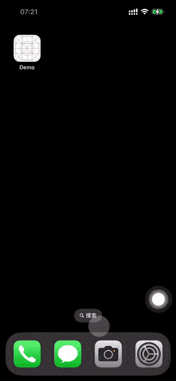
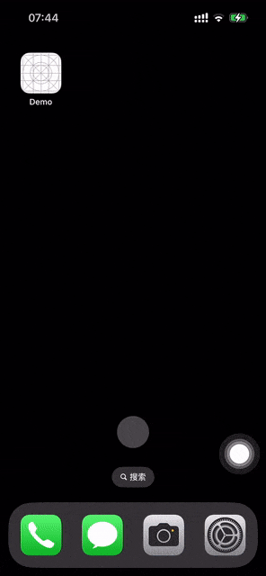

LLDynamicLaunchScreen
==============
[](https://github.com/internetWei/LLDynamicLaunchScreen/actions)&nbsp;&nbsp; [](https://github.com/internetWei/LLDynamicLaunchScreen/blob/master/LICENSE)&nbsp;&nbsp; [](https://github.com/Carthage/Carthage)&nbsp; &nbsp;[](http://cocoapods.org/pods/LLDynamicLaunchScreen)&nbsp;&nbsp; [](https://www.apple.com/nl/ios)&nbsp;&nbsp; [](https://juejin.cn/user/2418581312385288/posts)

__LLDynamicLaunchScreen__ 是1个专注于解决iOS上各种启动图问题的框架，它仅有 __78kb__，但这并不影响它的强大(`这绝对是你在iOS平台上能找到的最好的关于启动图的解决框架`)。

特性
==============

- 自动修复启动图显示异常。
- 不更新APP修改启动图(`支持从网络上下载图片`)。

演示
==============
| 修改启动图  | 自动修复异常 |
| :-------------: | :-------------: |
|   |   |

示例代码
==============
```objc
// objc示例代码：
// 在子线程中修改指定类型的启动图。
[LLDynamicLaunchScreen replaceLaunchImage:replaceImage type:LLLaunchImageTypeVerticalLight completed:nil];
```

```swift
// swift示例代码：
// 在子线程中修改指定类型的启动图。
LLDynamicLaunchScreen.replaceLaunch(replaceImage, type: .verticalLight, completed: nil)
```

系统要求
==============

只要你的项目启动图使用的是 `storyboard` 而非 `LaunchImage`，理论上没有最低版本限制；不过我只在iOS11.0及以上系统使用并测试过，如果你需要在低于iOS11.0的版本上使用，可以联系我：`internetwei@foxmail.com`。

安装
==============

### CocoaPods
1. 在 Podfile 中添加 `pod 'LLDynamicLaunchScreen'`。
2. 执行 `pod install` 或 `pod update`。
3. `#import <LLDynamicLaunchScreen/LLDynamicLaunchScreen.h>`。

### Carthage
1. 在 Cartfile 中添加 `github "internetWei/LLDynamicLaunchScreen"`。
2. 执行 `carthage update --platform ios` 并将生成的 framework 添加到你的工程。
3. `#import <LLDynamicLaunchScreen/LLDynamicLaunchScreen.h>`。

### 手动安装
1. 下载 `LLDynamicLaunchScreen` 文件夹内的所有内容。
2. 将LLDynamicLaunchScreen文件夹添加(拖放)到你的工程。
3. `#import "LLDynamicLaunchScreen.h"`。

注意事项
==============

* APP首次打开时(`更新APP后首次打开也算`)，会显示你在 storyboard 文件中配置的启动图，这是系统限制，暂无办法解决。

作者
==============

如果你有更好的改进，please pull reqeust me.

如果你有任何更好的意见，请创建一个[issue](https://github.com/internetWei/lldynamic-launch-screen/issues)。

或者直接联系作者`internetwei@foxmail.com`。

致谢
==============

* [DynamicLaunchImage](https://github.com/iversonxh/DynamicLaunchImage)
* [iOS启动图异常修复方案](https://mp.weixin.qq.com/s/giXmBAC0ft-kRB3BloawzA)

许可证
==============

__LLDynamicLaunchScreen__ 使用 MIT 许可证，详情见 LICENSE 文件。